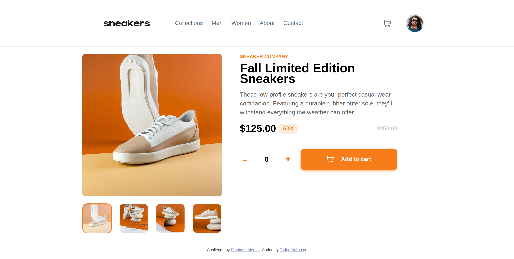

# Frontend Mentor - E-commerce product page solution

This is a solution to the [E-commerce product page challenge on Frontend Mentor](https://www.frontendmentor.io/challenges/ecommerce-product-page-UPsZ9MJp6). Frontend Mentor challenges help you improve your coding skills by building realistic projects.

## Table of contents

- [Overview](#overview)
  - [The challenge](#the-challenge)
  - [Screenshot](#screenshot)
  - [Links](#links)
- [My process](#my-process)
  - [Built with](#built-with)
  - [Continued development](#continued-development)
- [Author](#author)

## Overview

### The challenge

Users should be able to:

- View the optimal layout for the site depending on their device's screen size
- See hover states for all interactive elements on the page
- Open a lightbox gallery by clicking on the large product image
- Switch the large product image by clicking on the small thumbnail images
- Add items to the cart
- View the cart and remove items from it

### Screenshot

### Links

- Solution URL: [github.com/tadeubdev/frontend-mentor-sneakers](https://github.com/tadeubdev/frontend-mentor-sneakers)
- Live Site URL: [tadeubdev.github.io/frontend-mentor-sneakers](https://tadeubdev.github.io/frontend-mentor-sneakers/)

## My process

### Built with

- Semantic HTML5 markup
- CSS custom properties
- Flexbox
- CSS Grid
- Mobile-first workflow

### Continued development

I intend to develop this project with Vuejs in the future.

## Author

- Website - [github](https://github.com/tadeubdev)
- Frontend Mentor - [@tadeubdev](https://www.frontendmentor.io/profile/tadeubdev)
- Twitter - [@tadeubdev](https://www.twitter.com/tadeubdev)
